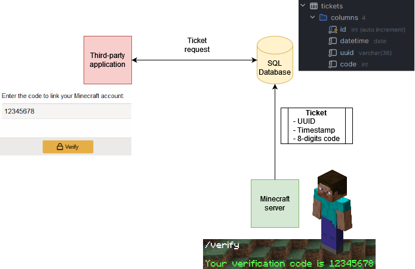

# Authenticator

## Description

A Minecraft plugin to help you set up a Minecraft verification process for a third-party application.
When player issues the command `/verify` on a Minecraft server (1.20.4) an 8-digits code is generated.

The following data (a Ticket) are then inserted into a SQL database :
- `datetime` (DATETIME) : The date the command was issued at
- `uuid` (VARCHAR(36)) : The player's UUID
- `code` (INT) : The 8-digits code

When a user tries to verify on a third-party application (a website for instance) he will be prompted a code. 
The application may then perform a request to the database to retrieve a Ticket with the given code.
If a Ticket is found, the UUID can be used to associate a Minecraft username to the website account.



**Note:** It is recommended for the third-party application to define an expiration delay for a Ticket 
(for instance: if the Ticket has been emitted more than 5 minutes ago it will no longer be considered as valid).

## Requirements

This plugin has been made for Minecraft 1.20.4 using [PaperMC](https://papermc.io/).

In order for this project to work you'll need :
- [Java 17](https://www.java.com)
- SQL Database with a `tickets` table configured as the following :
```sql
create table tickets
(
    id       int auto_increment
        primary key,
    datetime date        not null,
    uuid     varchar(36) not null,
    code     int         not null
)
    engine = InnoDB;
```
- Database user credentials and link in the [`src/main/java/ressources/config.yml`](src/main/resources/config.yml).

## Behavior

- The `/verify` command has a default cooldown of 5 minutes
- There can't be 2 Tickets with the same code in the database

> **Warning:** Since there is no system for deleting tickets, the database may be filled with 80 millions tickets. 
> In that scenario the plugin will no longer work.

## TODO

- [ ] Auto deleting old ticket after a certain amount of time (10 minutes)
- [ ] Log every issued tickets in a separated file
- [x] Regenerate the code if it's already found in the database
- [ ] Create a Docker Compose file to handle every service of this project (Minecraft Server, configured SQL database).

